### Windows

#### 环境准备

编译前，需要准备好依赖的各种环境。 这是我的本地环境，仅供参考，也可以根据自己的本地环境做适当调整。

- windows

  ```text 
  Edition	        Windows 10 Pro
  Version	        22H2
  Installed on    12/08/2023
  OS build	19045.3803
  Experience	Windows Feature Experience Pack 1000.19053.1000.0
  ```

- VisualStudio Community 2022

  [下载地址](https://visualstudio.microsoft.com/downloads/)

- swig
  ```bash
  $ swig -version
  SWIG Version 4.1.1
  Compiled with i686-w64-mingw32-g++ [i686-w64-mingw32]
  Configured options: +pcre
  ```
  可选安装方法:
    - `pip install swig`
    - `choco install swig`
    - `scoop install wsig`
    - [手动从官网下载安装](https://www.swig.org/download.html)

- ctpapi 6.7.0

  下载[上期技术官方](http://www.sfit.com.cn)的CTPAPI
    - 从上期技术官网下载

      下载页面 http://www.sfit.com.cn/5_2_DocumentDown_2_2.htm

      下载链接 http://www.sfit.com.cn/DocumentDown/api_3/5_2_2/v6.7.0_traderapi_20230209.zip

    - 从 [openctp](https://github.com/openctp) 下载

      由于上期技术官网不稳定，非交期时间段基本不提供服务

      下载页面 http://121.37.80.177:50080/Download.html
      下载链接 http://121.37.80.177:50080/Download/CTPAPI/CTP/ctp_6.7.0.zip

- python 3.10

  python3.10 也有多种安装方式, 全凭自己喜好。
    - [手动下载安装](https://registry.npmmirror.com/-/binary/python/3.10.11/python-3.10.11-amd64.exe)
    - 使用 pyenv 安装 `pyenv install 3.10.11`
    - 使用 conda

  *如果是Python新手也可以参考这篇文章  [我的Python环境管理小连招](../python-env/)*

#### 创建DLL项目

分别创建 `_thosttraderapi` 和 `_thostmduserapi` 项目
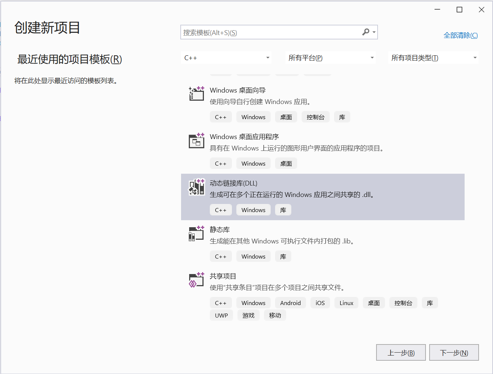
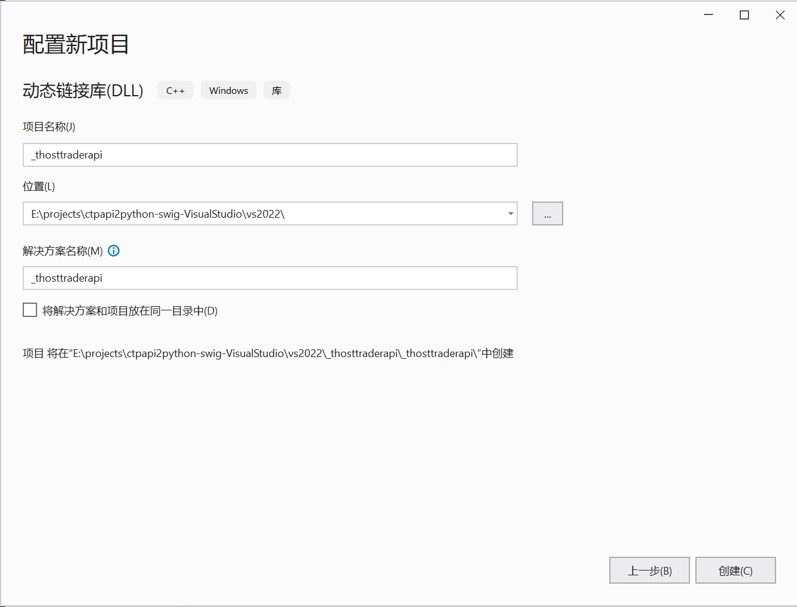
<details>
  <summary>PS E:\projects\ctpapi2python-swig-VisualStudio\vs2022> dir</summary>

  ```PowerShell
  PS E:\projects\ctpapi2python-swig-VisualStudio\vs2022> dir
  Mode                 LastWriteTime         Length Name
  ----                 -------------         ------ ----
  d-----        08/01/2024     14:30                _thostmduserapi
  d-----        08/01/2024     10:46                _thosttraderapi
  ```

</details>

#### 解压CTPAPI-6.7.0

解压后进入到路径 `v6.7.0_20230209_winApi\traderapi\20230209_traderapi64_se_windows`
<details>
  <summary>PS E:\v6.7.0_20230209_winApi\traderapi\20230209_traderapi64_se_windows> dir</summary>

  ```PowerShell 
  PS E:\projects\ctp-resources\6.7.0\v6.7.0_20230209_winApi\traderapi\20230209_traderapi64_se_windows> dir
  Mode                 LastWriteTime         Length Name
  ----                 -------------         ------ ----
  -a----        28/06/2022     11:59            184 error.dtd
  -a----        30/01/2023     14:42          21886 error.xml
  -a----        09/02/2023     10:02           5906 ThostFtdcMdApi.h
  -a----        09/02/2023     10:00          41046 ThostFtdcTraderApi.h
  -a----        09/02/2023     10:02         267340 ThostFtdcUserApiDataType.h
  -a----        09/02/2023     10:02         284938 ThostFtdcUserApiStruct.h
  -a----        09/02/2023     10:04        2960384 thostmduserapi_se.dll
  -a----        09/02/2023     10:04           3822 thostmduserapi_se.lib
  -a----        09/02/2023     10:02        3346944 thosttraderapi_se.dll
  -a----        09/02/2023     10:02           3960 thosttraderapi_se.lib
  ```

</details>

将头文件、库文件复制到 `E:\projects\ctpapi2python-swig-VisualStudio\vs2022` 路径下
<details>
  <summary>PS E:\projects\ctpapi2python-swig-VisualStudio\vs2022> dir</summary>

  ```PowerShell
  (base) PS E:\projects\ctpapi2python-swig-VisualStudio\vs2022> dir
  Mode                 LastWriteTime         Length Name
  ----                 -------------         ------ ----
  d-----        08/01/2024     10:46                _thosttraderapi
  d-----        08/01/2024     14:30                _thostmduserapi
  -a----        09/02/2023     10:02           5906 ThostFtdcMdApi.h
  -a----        09/02/2023     10:00          41046 ThostFtdcTraderApi.h
  -a----        09/02/2023     10:02         267340 ThostFtdcUserApiDataType.h
  -a----        09/02/2023     10:02         284938 ThostFtdcUserApiStruct.h
  -a----        09/02/2023     10:04        2960384 thostmduserapi_se.dll
  -a----        09/02/2023     10:04           3822 thostmduserapi_se.lib
  -a----        09/02/2023     10:02        3346944 thosttraderapi_se.dll
  -a----        09/02/2023     10:02           3960 thosttraderapi_se.lib
  ```

</details>

#### 添加 .i 文件

将 `thosttraderapi.i` `thostmduserapi.i` 文件也放到 `E:\projects\ctpapi2python-swig-VisualStudio\vs2022` 路径下
<details>
   <summary>thosttraderapi.i</summary>

  ```text
  %module(directors="1") thosttraderapi
  %{
  #include "ThostFtdcTraderApi.h"
  #include "iconv.h"
  %}
  %typemap(out) char[ANY], char[] {
  if ($1) {
  iconv_t cd = iconv_open("utf-8", "GBK");
  if (cd != (iconv_t)(-1)) {
  char buf[4096] = {};
  char **in = &$1;
  char *out = buf;
  size_t inlen = strlen($1), outlen = 4096;

              if (iconv(cd, in, &inlen, &out, &outlen) != (size_t)(-1))
              {
                  $result = SWIG_FromCharPtrAndSize(buf, sizeof buf - outlen);
              }
              iconv_close(cd);
          }
      }
  }
  %feature("python:annotations", "c");
  %feature("director") CThostFtdcTraderSpi;
  %ignore THOST_FTDC_VTC_BankBankToFuture;
  %ignore THOST_FTDC_VTC_BankFutureToBank;
  %ignore THOST_FTDC_VTC_FutureBankToFuture;
  %ignore THOST_FTDC_VTC_FutureFutureToBank;
  %ignore THOST_FTDC_FTC_BankLaunchBankToBroker;
  %ignore THOST_FTDC_FTC_BrokerLaunchBankToBroker;
  %ignore THOST_FTDC_FTC_BankLaunchBrokerToBank;
  %ignore THOST_FTDC_FTC_BrokerLaunchBrokerToBank;

  %include "ThostFtdcUserApiDataType.h"
  %include "ThostFtdcUserApiStruct.h"
  %include "ThostFtdcTraderApi.h" 
  ```

</details>
<details>
   <summary>thostmduserapi.i</summary>

  ```text
  %module(directors="1") thostmduserapi
  %{
  #include "ThostFtdcMdApi.h"
  #include "iconv.h"
  %}

  %feature("python:annotations", "c");
  %feature("director") CThostFtdcMdSpi;

  %typemap(out) char[ANY], char[] {
  if ($1) {
  iconv_t cd = iconv_open("utf-8", "GBK");
  if (cd != (iconv_t)(-1)) {
  char buf[4096] = {};
  char **in = &$1;
  char *out = buf;
  size_t inlen = strlen($1), outlen = 4096;

              if (iconv(cd, in, &inlen, &out, &outlen) != (size_t)(-1))
              {
                  $result = SWIG_FromCharPtrAndSize(buf, sizeof buf - outlen);
              }
              iconv_close(cd);
          }
      }
  }

  %typemap(in) char *[] {
  /* Check if is a list */
  if (PyList_Check($input)) {
  int size = PyList_Size($input);
  int i = 0;
  $1 = (char **) malloc((size+1)*sizeof(char *));
  for (i = 0; i < size; i++) {
  PyObject *o = PyList_GetItem($input, i);
  if (PyString_Check(o)) {
  $1[i] = PyString_AsString(PyList_GetItem($input, i));
  } else {
  free($1);
  PyErr_SetString(PyExc_TypeError, "list must contain strings");
  SWIG_fail;
  }
  }
  $1[i] = 0;
  } else {
  PyErr_SetString(PyExc_TypeError, "not a list");
  SWIG_fail;
  }
  }

  // This cleans up the char ** array we malloc'd before the function call
  %typemap(freearg) char ** {
  free((char *) $1);
  }

  %ignore THOST_FTDC_VTC_BankBankToFuture;
  %ignore THOST_FTDC_VTC_BankFutureToBank;
  %ignore THOST_FTDC_VTC_FutureBankToFuture;
  %ignore THOST_FTDC_VTC_FutureFutureToBank;
  %ignore THOST_FTDC_FTC_BankLaunchBankToBroker;
  %ignore THOST_FTDC_FTC_BrokerLaunchBankToBroker;
  %ignore THOST_FTDC_FTC_BankLaunchBrokerToBank;
  %ignore THOST_FTDC_FTC_BrokerLaunchBrokerToBank;

  %include "ThostFtdcUserApiDataType.h"
  %include "ThostFtdcUserApiStruct.h"
  %include "ThostFtdcMdApi.h"
  ```

</details>


<details>
   <summary>PS E:\projects\ctpapi2python-swig-VisualStudio\vs2022> dir</summary>

  ```PowerShell 
  PS E:\projects\ctpapi2python-swig-VisualStudio\vs2022> dir
  Mode                 LastWriteTime         Length Name
  ----                 -------------         ------ ----
  d-----        08/01/2024     14:30                _thostmduserapi
  d-----        08/01/2024     10:46                _thosttraderapi
  -a----        09/02/2023     10:02           5906 ThostFtdcMdApi.h
  -a----        09/02/2023     10:00          41046 ThostFtdcTraderApi.h
  -a----        09/02/2023     10:02         267340 ThostFtdcUserApiDataType.h
  -a----        09/02/2023     10:02         284938 ThostFtdcUserApiStruct.h
  -a----        08/01/2024     14:25           1752 thostmduserapi.i
  -a----        09/02/2023     10:04        2960384 thostmduserapi_se.dll
  -a----        09/02/2023     10:04           3822 thostmduserapi_se.lib
  -a----        08/01/2024     14:25           1110 thosttraderapi.i
  -a----        09/02/2023     10:02        3346944 thosttraderapi_se.dll
  -a----        09/02/2023     10:02           3960 thosttraderapi_se.lib
  ```

</details>

#### 添加iconv库

Python3 统一使用 UTF-8 编码， CTPAPI使用 GBK 编码, 需要 [libiconv](https://www.gnu.org/software/libiconv/) 进行编码转换

<details>
  <summary>PS E:\projects\ctpapi2python-swig-VisualStudio\vs2022> dir</summary>

```PowerShell
PS E:\projects\ctpapi2python-swig-VisualStudio\vs2022> dir
Mode                 LastWriteTime         Length Name
----                 -------------         ------ ----
d-----        08/01/2024     14:30                _thostmduserapi
d-----        08/01/2024     10:46                _thosttraderapi
-a----        08/01/2024     10:34           9511 iconv.h
-a----        08/01/2024     10:34        1094144 libiconv.dll
-a----        09/02/2023     10:02           5906 ThostFtdcMdApi.h
-a----        09/02/2023     10:00          41046 ThostFtdcTraderApi.h
-a----        09/02/2023     10:02         267340 ThostFtdcUserApiDataType.h
-a----        09/02/2023     10:02         284938 ThostFtdcUserApiStruct.h
-a----        08/01/2024     14:25           1752 thostmduserapi.i
-a----        09/02/2023     10:04        2960384 thostmduserapi_se.dll
-a----        09/02/2023     10:04           3822 thostmduserapi_se.lib
-a----        08/01/2024     14:25           1110 thosttraderapi.i
-a----        09/02/2023     10:02        3346944 thosttraderapi_se.dll
-a----        09/02/2023     10:02           3960 thosttraderapi_se.lib
```

</details>

#### swig根据 .i 文件生成 python接口文件和wrap文件

```PowerShell 
swig -threads -c++ -python thosttraderapi.i
swig -threads -c++ -python thostmduserapi.i
```

`thosttraderapi` 生成3个新文件:

  ```text 
  thosttraderapi.py
  thosttraderapi_wrap.h
  thosttraderapi_wrap.cxx
  ```

`thostmduserapi` 生成3个新文件:

```text 
thostmduserapi.py
thostmduserapi_wrap.h
thostmduserapi_wrap.cxx
```

<details>
  <summary>PS E:\projects\ctpapi2python-swig-VisualStudio\vs2022> dir</summary>

```PowerShell 
Mode                 LastWriteTime         Length Name
----                 -------------         ------ ----
d-----        08/01/2024     14:30                _thostmduserapi
d-----        08/01/2024     10:46                _thosttraderapi
-a----        08/01/2024     10:34           9511 iconv.h
-a----        08/01/2024     10:34        1094144 libiconv.dll
-a----        09/02/2023     10:02           5906 ThostFtdcMdApi.h
-a----        09/02/2023     10:00          41046 ThostFtdcTraderApi.h
-a----        09/02/2023     10:02         267340 ThostFtdcUserApiDataType.h
-a----        09/02/2023     10:02         284938 ThostFtdcUserApiStruct.h
-a----        08/01/2024     14:25           1752 thostmduserapi.i
-a----        08/01/2024     15:00        1188716 thostmduserapi.py
-a----        09/02/2023     10:04        2960384 thostmduserapi_se.dll
-a----        09/02/2023     10:04           3822 thostmduserapi_se.lib
-a----        08/01/2024     15:00       15030685 thostmduserapi_wrap.cxx
-a----        08/01/2024     15:00           3365 thostmduserapi_wrap.h
-a----        08/01/2024     14:25           1110 thosttraderapi.i
-a----        08/01/2024     15:00        1246410 thosttraderapi.py
-a----        09/02/2023     10:02        3346944 thosttraderapi_se.dll
-a----        09/02/2023     10:02           3960 thosttraderapi_se.lib
-a----        08/01/2024     15:00       15745002 thosttraderapi_wrap.cxx
-a----        08/01/2024     15:00          20855 thosttraderapi_wrap.h
```

</details>

#### _thosttraderapi 项目配置

1. 添加头文件
    ```text
    iconv.h
    ThostFtdcTraderApi.h
    ThostFtdcUserApiDataType.h
    ThostFtdcUserApiStruct.h
    thosttraderapi_wrap.cxx
    ```
   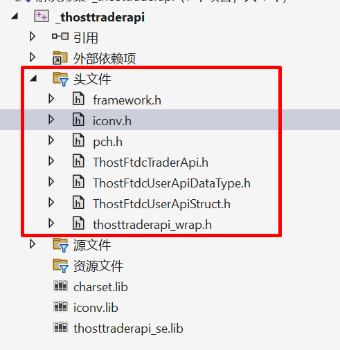
2. 添加源文件 `thosttraderapi_wrap.cxx`
   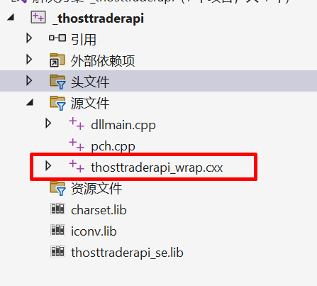

3. 添加库文件
   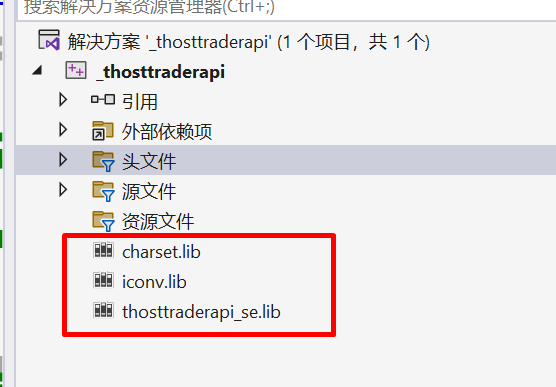
4. 附加包含目录
   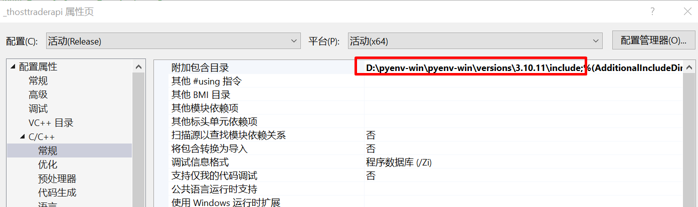
5. 附加库目录
   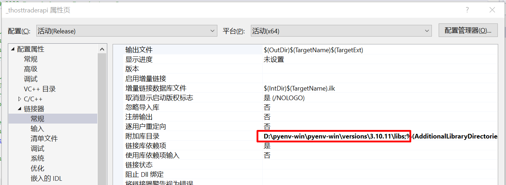
6. 附加依赖项
   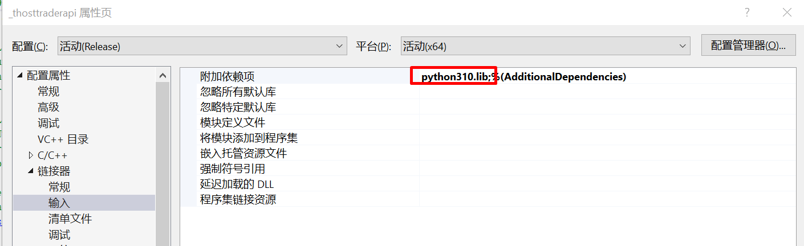
7. 不使用预编译头
   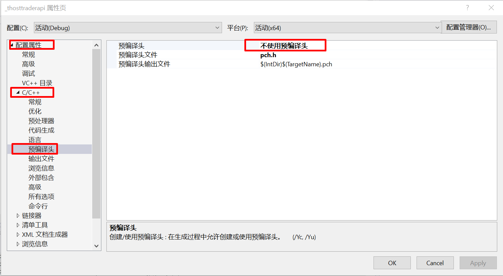
8. 添加编译项 `/bigobj`
   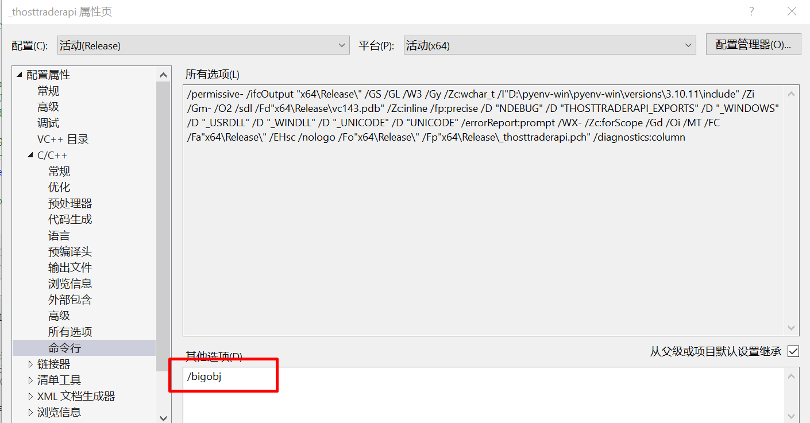
9. 运行库 /MT
   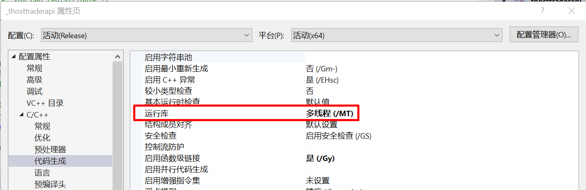
10. 选择平台 Release x64
    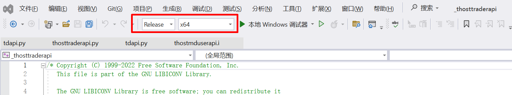
11. 构建生成 dll 文件

    在 `_thosttraderapi\x64\Release` 路径下会生成一个 `_thosttraderapi.dll` 文件, 将 `_thosttraderapi.dll`
    重命名为 `_thosttraderapi.pyd` 并移动至路径 `E:\projects\ctpapi2python-swig-VisualStudio\vs2022`下
    ```text
    已启动重新生成...
    1>------ 已启动全部重新生成: 项目: _thosttraderapi, 配置: Release x64 ------
    1>pch.cpp
    1>thosttraderapi_wrap.cxx
    1>E:\projects\ctpapi2python-swig-VisualStudio\vs2022\ThostFtdcUserApiDataType.h(3706,1): warning C4819: 该文件包含不能在当前代码页(936)中表示的字符。请将该文件保存为 Unicode 格式以防止数据丢失
    1>E:\projects\ctpapi2python-swig-VisualStudio\vs2022\ThostFtdcUserApiDataType.h(4468,1): warning C4819: 该文件包含不能在当前代码页(936)中表示的字符。请将该文件保存为 Unicode 格式以防止数据丢失
    1>E:\projects\ctpapi2python-swig-VisualStudio\vs2022\iconv.h(1,1): warning C4819: 该文件包含不能在当前代码页(936)中表示的字符。请将该文件保存为 Unicode 格式以防止数据丢失
    1>dllmain.cpp
    1>  正在创建库 E:\projects\ctpapi2python-swig-VisualStudio\vs2022\_thosttraderapi\x64\Release\_thosttraderapi.lib 和对象 E:\projects\ctpapi2python-swig-VisualStudio\vs2022\_thosttraderapi\x64\Release\_thosttraderapi.exp
    1>正在生成代码
    1>Previous IPDB not found, fall back to full compilation.
    1>All 11713 functions were compiled because no usable IPDB/IOBJ from previous compilation was found.
    1>已完成代码的生成
    1>_thosttraderapi.vcxproj -> E:\projects\ctpapi2python-swig-VisualStudio\vs2022\_thosttraderapi\x64\Release\_thosttraderapi.dll
    1>已完成生成项目“_thosttraderapi.vcxproj”的操作。
    ========== “全部重新生成”: 1 成功，0 失败，0已跳过 ==========
    ========= 重新生成 开始于 20:23，并花费了 16.648 秒 ==========
    ```

#### _thostmduserapi 项目配置

和 `_thosttraderapi` 的配置逻辑一致， 区别如下:

1. 添加头文件
    ```text
    iconv.h
    ThostFtdcTraderApi.h
    ThostFtdcUserApiDataType.h
    ThostFtdcUserApiStruct.h
    thostmduserapi_wrap.cxx
    ```
2. 添加源文件 `thostmduserapi_wrap.cxx`
3. 构建生成 dll 文件
   在 `_thostmduserapi\x64\Release` 路径下会生成一个 `_thostmduserapi.dll` 文件, 将 `_thostmduserapi.dll`
   重命名为 `_thostmduserapi.pyd` 并移动至路径 `E:\projects\ctpapi2python-swig-VisualStudio\vs2022`下

#### 测试交易、行情接口

交易接口、行情接口 前置地址，参考 [openctp监控](http://121.37.80.177:50080/detail.html) SimNow

1. 交易接口

    测试需要用到文件: 
    ```text 
    demo_td.py
    iconv.dll
    charset.dll
    thosttraderapi_se.dll
    _thosttraderapi.pyd
    thosttraderapi.py
    ```
    <details>
      <summary>demo_td.py</summary>

    ```python 
    import sys
    import time
    import os

    import thosttraderapi as tdapi

    # 前置地址 参考 http://121.37.80.177:50080/detail.html  SimNow
    FrontAddr = ""

    # 登录信息 需要在 SimNow https://www.simnow.com.cn/ 平台注册账号
    userid = ""
    password = ""
    brokerid = "9999"
    authcode = "0000000000000000"
    appid = "simnow_client_test"


    class CTdSpiImpl(tdapi.CThostFtdcTraderSpi):
    """交易回调实现类"""

        def __init__(self):
            super().__init__()

            flow_path = os.path.join(os.getcwd(), "flow_logs", userid)
            if not os.path.exists(flow_path):
                os.makedirs(flow_path)
            flow_path = os.path.join(flow_path, userid)
            self._api: tdapi.CThostFtdcTraderApi = (
                tdapi.CThostFtdcTraderApi.CreateFtdcTraderApi(flow_path)
            )

            print("CTP交易API版本号:", self._api.GetApiVersion())

            # 注册交易前置
            self._api.RegisterFront(FrontAddr)
            # 注册交易回调实例
            self._api.RegisterSpi(self)
            # 订阅私有流
            self._api.SubscribePrivateTopic(tdapi.THOST_TERT_QUICK)
            # 订阅公有流
            self._api.SubscribePublicTopic(tdapi.THOST_TERT_QUICK)
            # 初始化交易实例
            self._api.Init()

        def OnFrontConnected(self):
            """交易前置连接成功"""
            print("交易前置连接成功")
            self.authenticate()

        def OnFrontDisconnected(self, nReason: int):
            """交易前置连接断开"""
            print("交易前置连接断开: nReason=", nReason)

        def authenticate(self):
            """认证 demo"""
            print("> 认证请求")
            _req = tdapi.CThostFtdcReqAuthenticateField()
            _req.BrokerID = brokerid
            _req.UserID = userid
            _req.AppID = appid
            _req.AuthCode = authcode
            self._api.ReqAuthenticate(_req, 0)

        def OnRspAuthenticate(
            self,
            pRspAuthenticateField: tdapi.CThostFtdcRspAuthenticateField,
            pRspInfo: tdapi.CThostFtdcRspInfoField,
            nRequestID: int,
            bIsLast: bool,
        ):
            """客户端认证响应"""
            if pRspInfo:
                print("认证响应", pRspInfo.ErrorID, pRspInfo.ErrorMsg)
            if pRspInfo and pRspInfo.ErrorID != 0:
                return

            # 登录
            self.login()

        def login(self):
            """登录 demo"""
            print("> 登录请求")

            _req = tdapi.CThostFtdcReqUserLoginField()
            _req.BrokerID = brokerid
            _req.UserID = userid
            _req.Password = password
            if sys.platform == "darwin":
                self._api.ReqUserLogin(_req, 0, 0, "")
            else:
                self._api.ReqUserLogin(_req, 0)

        def OnRspUserLogin(
            self,
            pRspUserLogin: tdapi.CThostFtdcRspUserLoginField,
            pRspInfo: tdapi.CThostFtdcRspInfoField,
            nRequestID: int,
            bIsLast: bool,
        ):
            """登录响应"""
            if pRspInfo:
                print("登录响应", pRspInfo.ErrorID, pRspInfo.ErrorMsg)


    if __name__ == "__main__":
        if len(sys.argv) != 4:
            print("Usage:    python demo_td <frontaddr> <userid> <password>")
            exit(-1)

        FrontAddr = sys.argv[1]
        userid = sys.argv[2]
        password = sys.argv[3]

        spi = CTdSpiImpl()
        time.sleep(1)
        input("################# 按任意键退出 \n")
    ```
    </details>

   因为使用 Python3.10 编译的，所以使用 Python3.10 测试。在路径`PS E:\projects\ctpapi2python-swig-VisualStudio\vs2022>`
   下执行以下命令, userid/password 是在 simnow 平台注册的账号、密码

    ```PowerShell
    > python demo_td.py tcp://180.168.146.187:10130 <userid> <password>
    CTP交易API版本号: v6.7.0_20230209  9:52:16.3535
    Connect to 180.168.146.187:10130
    Session -312410111 Connected
    交易前置连接成功
    > 认证请求
    认证响应 0 正确
    > 登录请求
    登录响应 0 正确
    ################# 按任意键退出
    ```

2. 行情接口

   测试需要用到文件:
    ```text 
    demo_md.py
    iconv.dll
    charset.dll
    thostmduserapi_se.dll
    _thostmduserapi.pyd
    thosttmduserapi.py
    ```

   <details>
        <summary>demo_md.py</summary>  

    ```python
    """
    行情API demo

    注意选择有效合约, 没有行情可能是过期合约或者不再交易时间内导致
    """

    import inspect
    import os
    import sys

    import thostmduserapi as mdapi

    # 前置地址 参考 http://121.37.80.177:50080/detail.html  SimNow
    FrontAddr = ""
    # 注意选择有效合约, 没有行情可能是过期合约或者不在交易时间内的原因
    # instruments = ["AP410"]


    class CMdSpiImpl(mdapi.CThostFtdcMdSpi):
        def __init__(self):
            super().__init__()

            flow_path = os.path.join(os.getcwd(), "flow_logs", 'market')
            if not os.path.exists(flow_path):
                os.makedirs(flow_path)
            flow_path = os.path.join(flow_path, 'market')

            self._api = mdapi.CThostFtdcMdApi.CreateFtdcMdApi(flow_path)

            print("CTP行情API版本号:", self._api.GetApiVersion())

            # 注册行情前置
            self._api.RegisterFront(FrontAddr)
            # 注册行情回调实例
            self._api.RegisterSpi(self)
            # 初始化行情实例
            self._api.Init()
            print("初始化成功")

        def OnFrontConnected(self):
            """行情前置连接成功"""
            print("行情前置连接成功")

            # 登录请求, 行情登录不进行信息校验
            print("登录请求")
            req = mdapi.CThostFtdcReqUserLoginField()
            self._api.ReqUserLogin(req, 0)

        def OnRspUserLogin(
                self,
                pRspUserLogin: mdapi.CThostFtdcRspUserLoginField,
                pRspInfo: mdapi.CThostFtdcRspInfoField,
                nRequestID: int,
                bIsLast: bool,
        ):
            """登录响应"""
            if pRspInfo and pRspInfo.ErrorID != 0:
                print(
                    f"登录失败: ErrorID={pRspInfo.ErrorID}, ErrorMsg={pRspInfo.ErrorMsg}"
                )
                return

            print("登录成功")

            if len(instruments) == 0:
                return

            # 订阅行情
            print("订阅行情请求：", instruments)
            self._api.SubscribeMarketData(
                [i.encode("utf-8") for i in instruments], len(instruments)
            )

        def OnRtnDepthMarketData(
                self, pDepthMarketData: mdapi.CThostFtdcDepthMarketDataField
        ):
            """深度行情通知"""
            params = []
            for name, value in inspect.getmembers(pDepthMarketData):
                if name[0].isupper():
                    params.append(f"{name}={value}")
            print("深度行情通知:", ",".join(params))

        def OnRspSubMarketData(
                self,
                pSpecificInstrument: mdapi.CThostFtdcSpecificInstrumentField,
                pRspInfo: mdapi.CThostFtdcRspInfoField,
                nRequestID: int,
                bIsLast: bool,
        ):
            """订阅行情响应"""
            if pRspInfo:
                print("订阅行情", pRspInfo.ErrorID, pRspInfo.ErrorMsg)
                return


    if __name__ == "__main__":
        if len(sys.argv) < 3:
            print("Usage:    python demo_td <frontaddr> <instrument_id1> <instrument_id2> ...")
            exit(-1)

        FrontAddr = sys.argv[1]
        # 注意选择有效合约, 没有行情可能是过期合约或者不在交易时间内的原因
        instruments = sys.argv[2:]
        spi = CMdSpiImpl()
        input("############# 按任意键退出 \n")
     
    ```
   </details>

   执行如下命令, 命令后可跟多个有效合约:
   ```PowerShell 
   > python .\demo_md.py tcp://180.168.146.187:10131 AP401
    登录请求
    登录成功
    订阅行情请求： ['AP401']
    订阅行情 0 CTP:No Error
    深度行情通知: ActionDay=20240104,AskPrice1=8650.0,AskPrice2=1.7976931348623157e+308,AskPrice3=1.7976931348623157e+308,AskPrice4=1.7976931348623157e+308,AskPrice5=1.7976931348623157e+308,AskVolume1=1,AskVolume2=0,AskVolume3=0,AskVolume4=0,AskVolume5=0,AveragePrice=8600.0,BandingLowerPrice=0.0,BandingUpperPrice=0.0,BidPrice1=8600.0,BidPrice2=1.7976931348623157e+308,BidPrice3=1.7976931348623157e+308,BidPrice4=1.7976931348623157e+308,BidPrice5=1.7976931348623157e+308,BidVolume1=7,BidVolume2=0,BidVolume3=0,BidVolume4=0,BidVolume5=0,ClosePrice=1.7976931348623157e+308,CurrDelta=1.7976931348623157e+308,ExchangeID=,ExchangeInstID=,HighestPrice=8601.0,InstrumentID=AP401,LastPrice=8600.0,LowerLimitPrice=7745.0,LowestPrice=8600.0,OpenInterest=229.0,OpenPrice=8600.0,PreClosePrice=8557.0,PreDelta=0.0,PreOpenInterest=234.0,PreSettlementPrice=8606.0,SettlementPrice=1.7976931348623157e+308,TradingDay=20240105,Turnover=232200.0,UpdateMillisec=0,UpdateTime=21:39:43,UpperLimitPrice=9467.0,Volume=27 
   ```

以上就是使用 VisualStudio 2022 IDE 通过 swig 将 CTPAPI，装换为 python 的整个流程了。如果是使用其他版本的 VisualStudio 或
构建目标为 win32 平台，逻辑是一样的，只要参照以上，同时将相应库改为win32的即可。

同时，以上工程已上传至 [https://github.com/openctp/ctpapi2python-swig-VisualStudio](https://github.com/openctp/ctpapi2python-swig-VisualStudio), 可下载参考。

### Linux

### MacOS