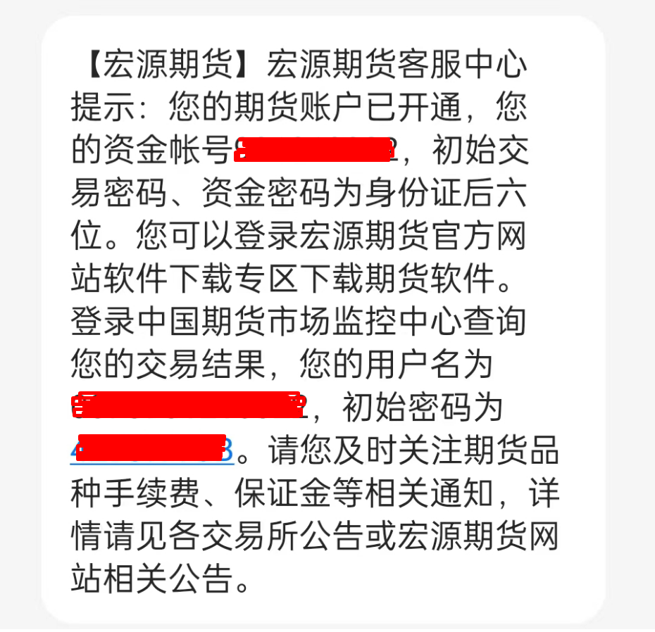
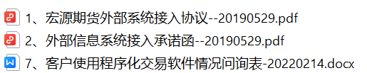
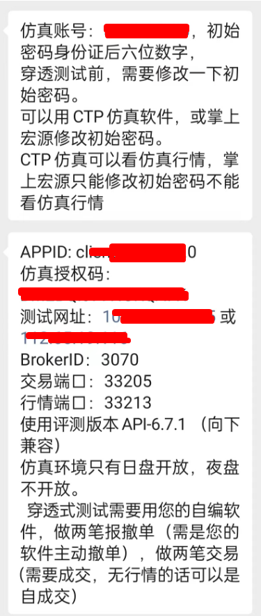
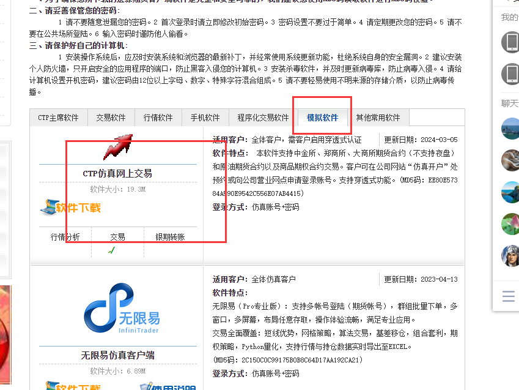

前段时间在宏源期货开了个期货账户，并且申请了程序化交易。按照正常流程，需要进行一个穿透测试。

简单记录一下我的整个穿测流程吧

### 开户申请

开始的时候直接联系了开户经理，按照提示，在 掌上宏源app 里进行的开户申请。需要提前准备身份证、银行卡等信息。
记得当时一两个工作日就开好了，还挺快的。开户成功后，会收到一条短信

里面包含了 资金账号、初始交易密码、资金密码，以及 [中国期货市场监控中心](http://www.cfmmc.com/)账号,
在中国期货市场监控中心可以查看如图的个人账户信息。

### 程序化交易

申请程序化交易，分为两步，需要先申请仿真环境的账号、授权码，在仿真环境进行穿透测试没问题以后，才可以申请拿到实盘的地址、授权码。
需要提供 姓名、身份证号、手机号等个人信息，以及程序appid(client_软件名_1.0.0格式)。
同时需要签署一些协议

#### 穿透测试

仿真环境申请后，可以拿到仿真账号、授权码、测试地址和端口等其他信息，一定要按照提示操作，否则可能出现问题。
宏源本身提供了查看仿真环境的软件,可以从CTP仿真上看那个品种比较活跃，然后交易哪个品种。
[CTP仿真软件下载地址](http://www.hongyuanqh.com/hyqhnew/kfzx/rjxz.jsp?1=1&oneMenuId=000200010007&twoMenuId=0002000100070008&biaoji=infolist#this)

之前写过一个 [openctp-ctp](https://github.com/openctp/openctp-ctp-python), 是专门用来对接期货CTPAPI的。
但是 openctp-ctp 是生产版本CTPAPI转换而成的， 穿透测试需要使用评测版本CTPAPI才可以，之前网友也遇到过需要穿透测试的场景，虽然有现成的CTPAPI，但是C++毕竟不是每个人都能熟练使用的，
索性重新写了一个专门用于穿透测试的Python版CTPAPI库 [openctp-ctp-ctp](https://github.com/openctp/openctp-ctp-python/blob/main/README.md#%E8%AF%84%E6%B5%8B%E7%89%88)
，也支持多版本多平台。 使用方法也简单，直接参考 openctp-ctp, 虽然底层协议有差异，但是接口和参数都是一致的。

#### 拿到实盘授权

穿透测试测试后，就可以拿到实盘的地址和授权码，愉快的进行程序化交易了。
