本地机器: Windows 10

VirtualBox: 7.0.12 r159484 (Qt5.15.2)

### 申请试用

个人用户需要申请才能拿到麒麟操作系统的试用版, 有效期一般1年

https://www.kylinos.cn/support/trial.html

一般申请马上就能通过，会跳到一个试用版下载链接页面
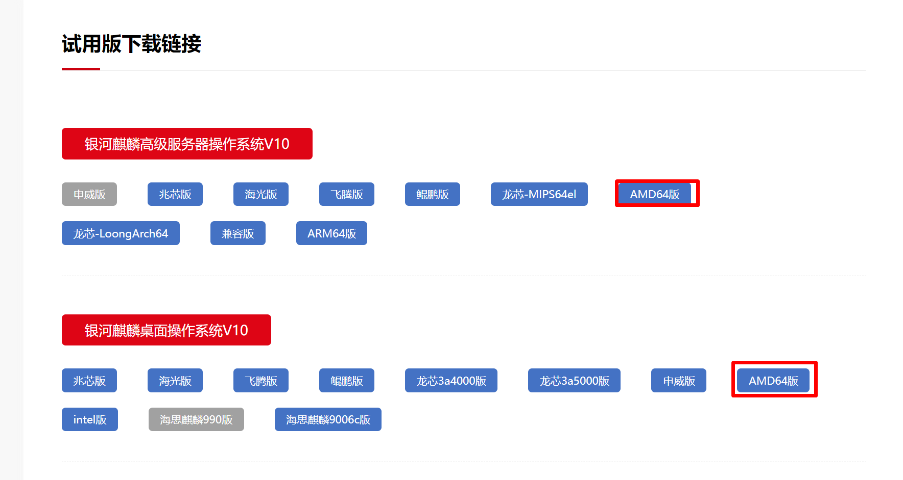

选择 银河麒麟高级服务器操作系统V10 AMD64，点击后会出现一个下载页面

按照提示下载即可， 我这里下载到的是 Kylin-Server-V10-SP3-General-Release-2303-X86_64.iso

下载后验证文件sha256码是否正确, PowerShell 下命令是 `Get-FileHash <file>`

### 创建配置虚拟机

#### 创建

命名
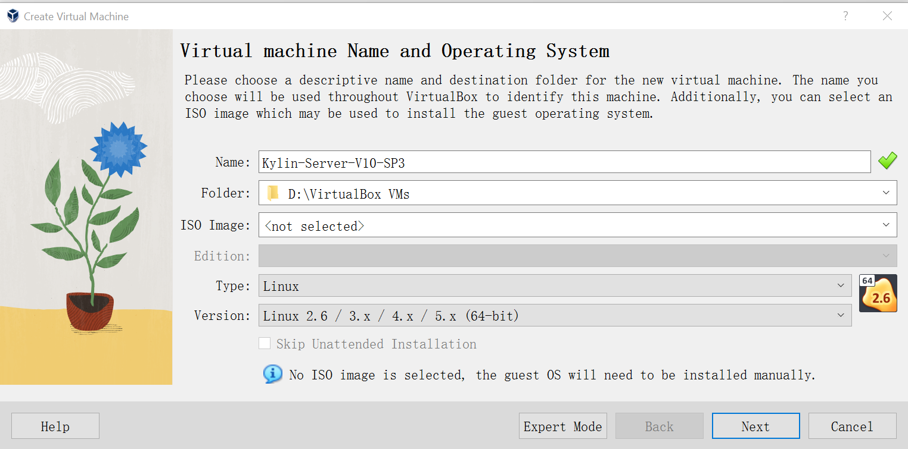

#### 硬件配置

内存4G, 处理器 2
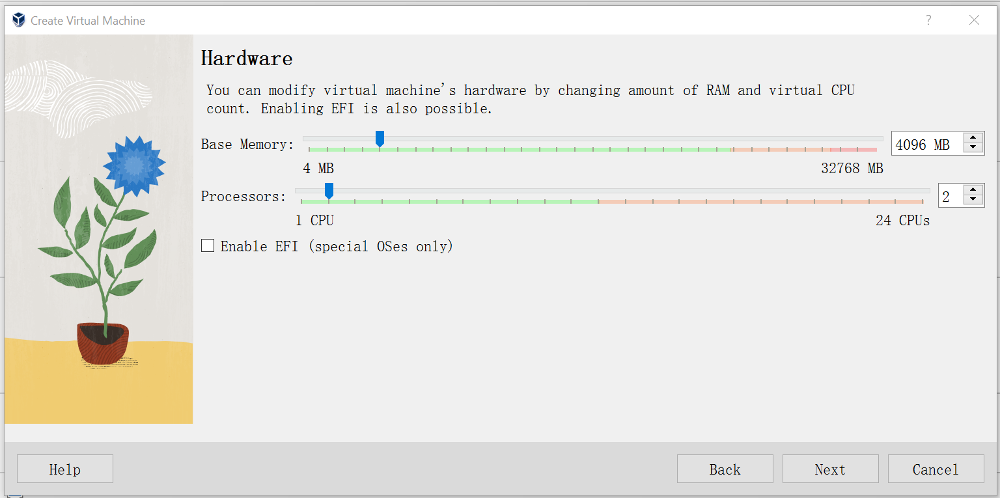

#### 虚拟硬盘

20G
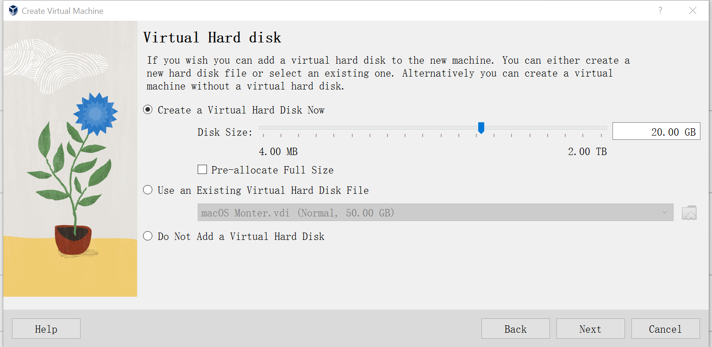
完成基本配置
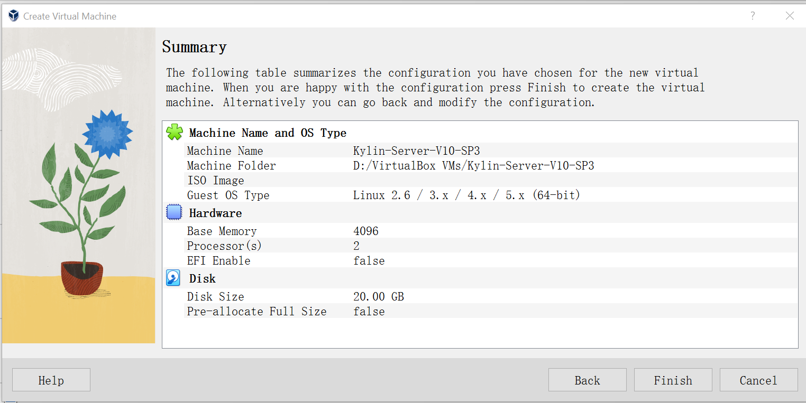

#### 存储

IDE控制器，选择下载好的iso文件
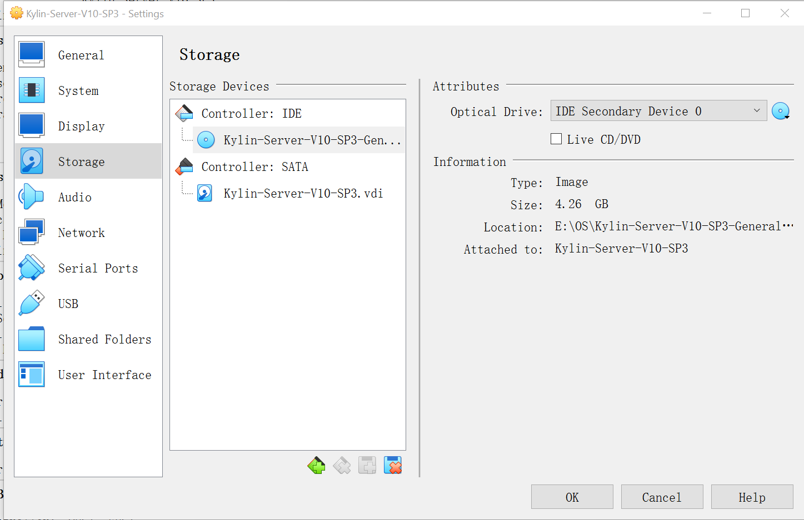

#### 显示

Video Memory 选择64M
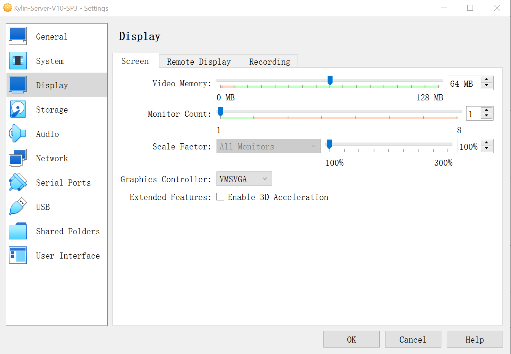

#### 网络

适配器1
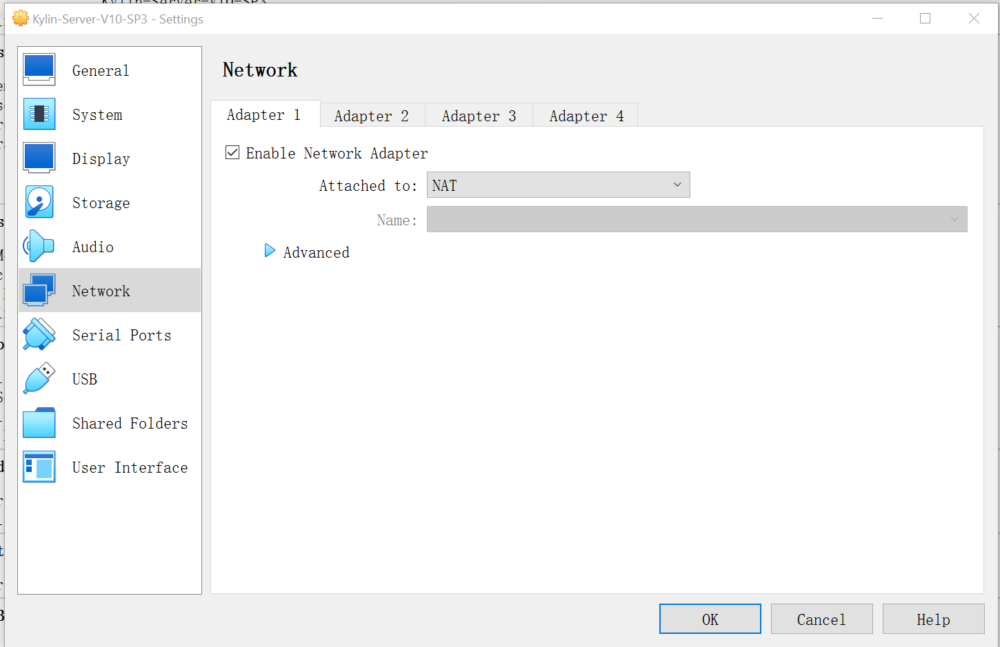
适配器2
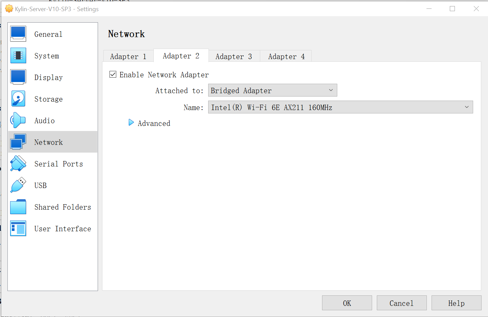

### 安装

启动虚拟机

#### 启动

使用上下箭头选择第一个, 回车执行
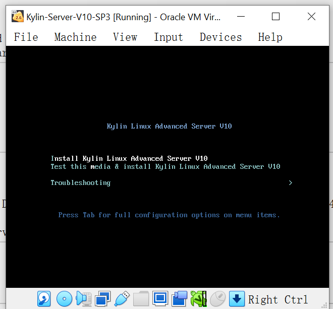

#### 选择中文

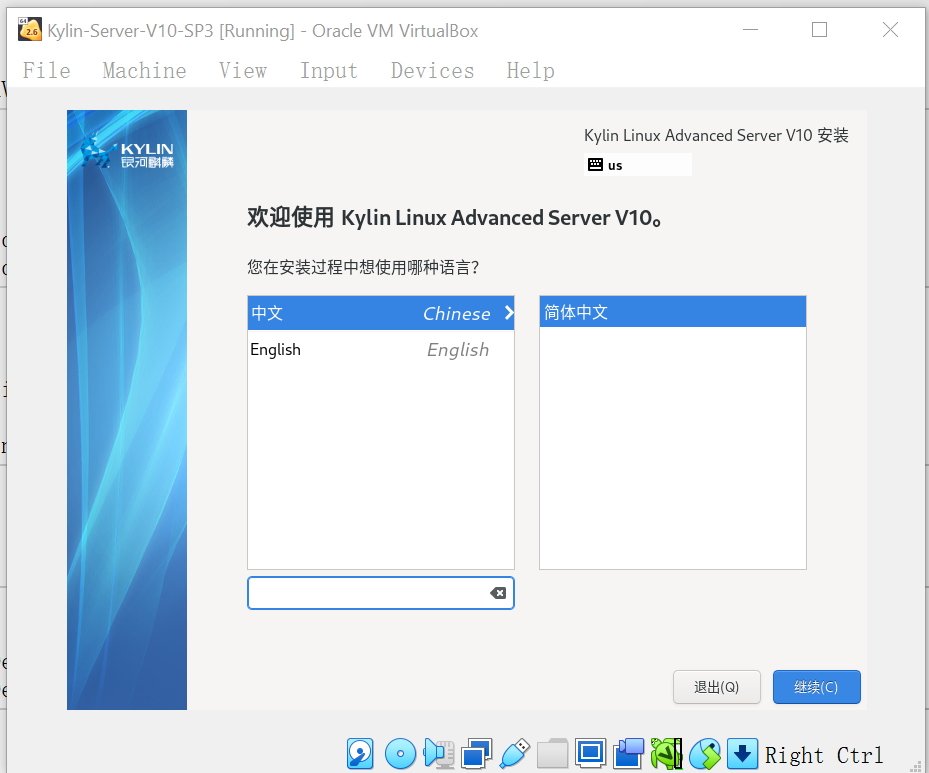

#### 基本配置

将图中感叹号标记的项目都配置好
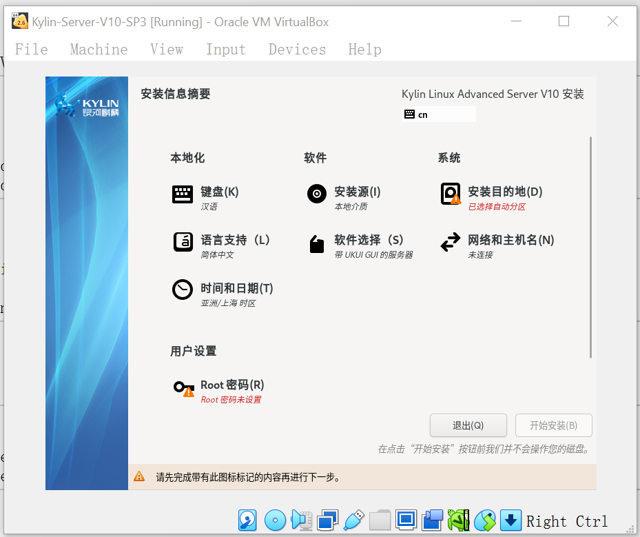
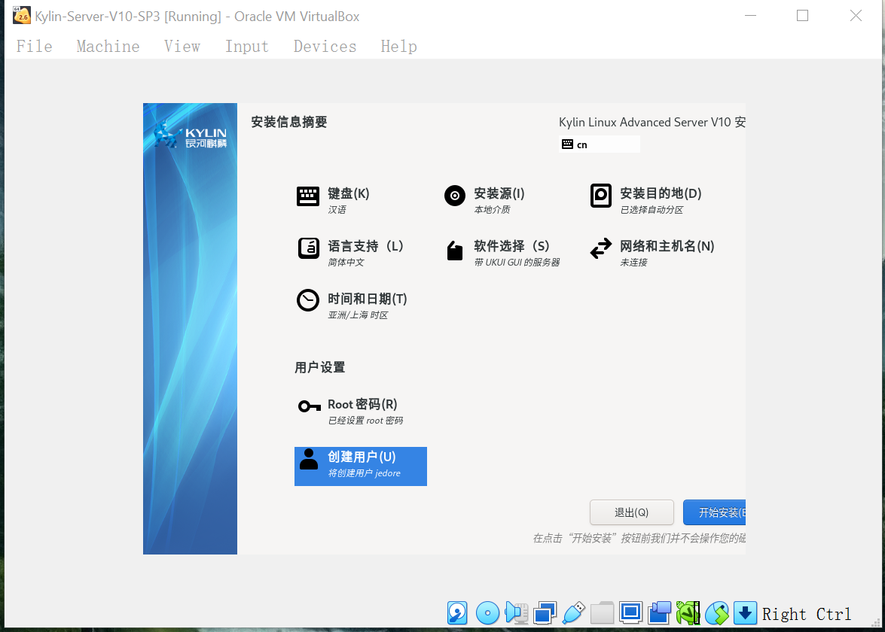

#### 安装进度

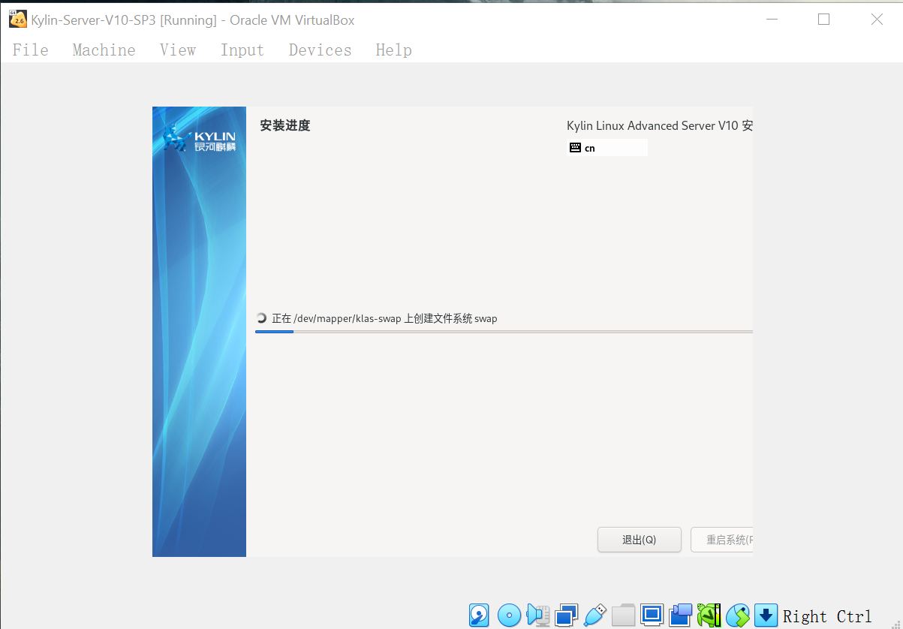
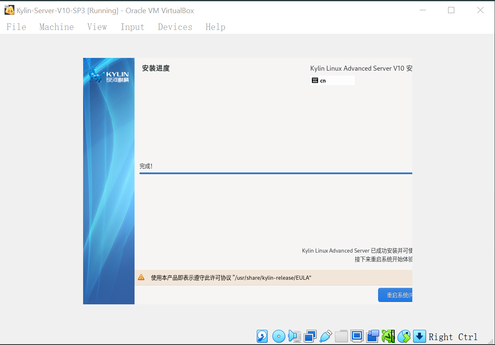

#### 安装完成

安装完成后，重启如下图, 选择第一项回车
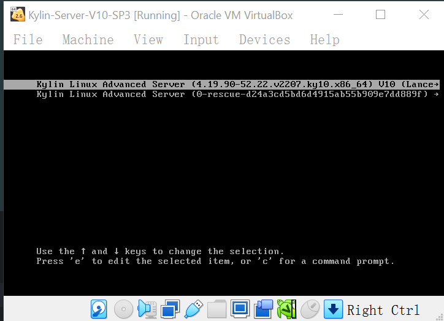
输入创建的用户密码即可登录
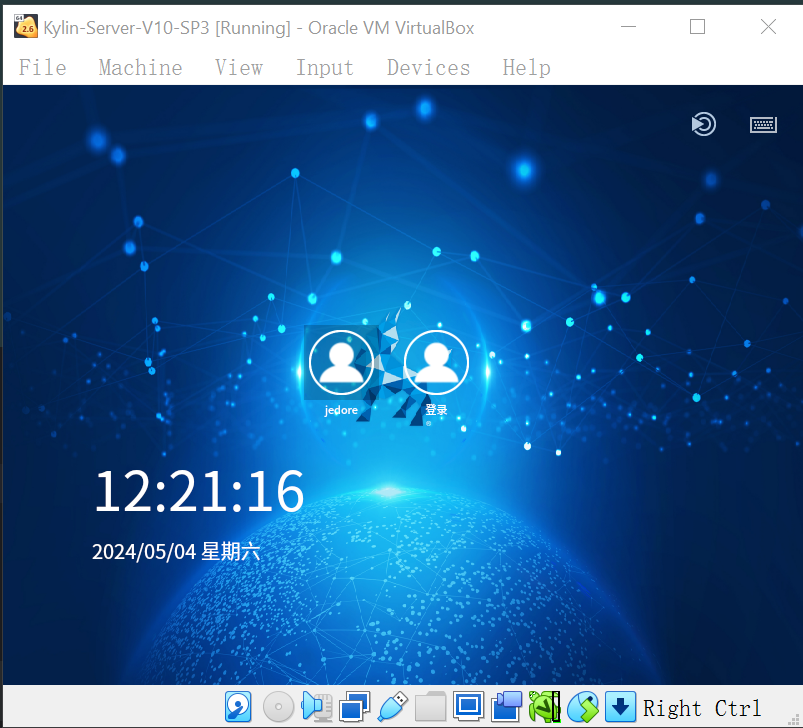
登录后，如果网络未连接，点击右下角托盘中的网络图标，选择网络连接即可。

> 更多资料参考
> - [银河麒麟高级服务器操作系统V10 SP3 安装手册](https://gongce.kylinos.cn/static/img/2024/01/efce579561b2679e1826bffaa91b6915.pdf)
> - [银河麒麟高级服务器操作系统 V10系统管理员手册](https://gongce.kylinos.cn/static/qilin/res/230925/c571764653e7b73dbbd9ae70f879a634.pdf)
> - [银河麒麟高级服务器操作系统 V10 产品手册](https://gongce.kylinos.cn/static/img/2024/01/6ddc3c1342d75bf9f55f4f286fec52e3.pdf)
