### 环境准备

以我本地的环境为参考

- Windows 10 专业版
    ```text
    Edition	    Windows 10 Pro
    Version	    22H2
    Installed on	12/08/2023
    OS build	19045.3930
    Experience	Windows Feature Experience Pack 1000.19053.1000.0
    ```
- MacOS Monterey
  [下载地址](https://www.mediafire.com/file/8mu06mxnqe7i6eg/macOS_Monterey.7z/file)
  下载后解压得到一个 `iso` 文件
- VirtualBox 7.0.12
- VirtualBox Extension Pack 7.0.12

### 安装

#### 创建Mac虚拟机

##### 虚拟机名称、操作系统选择

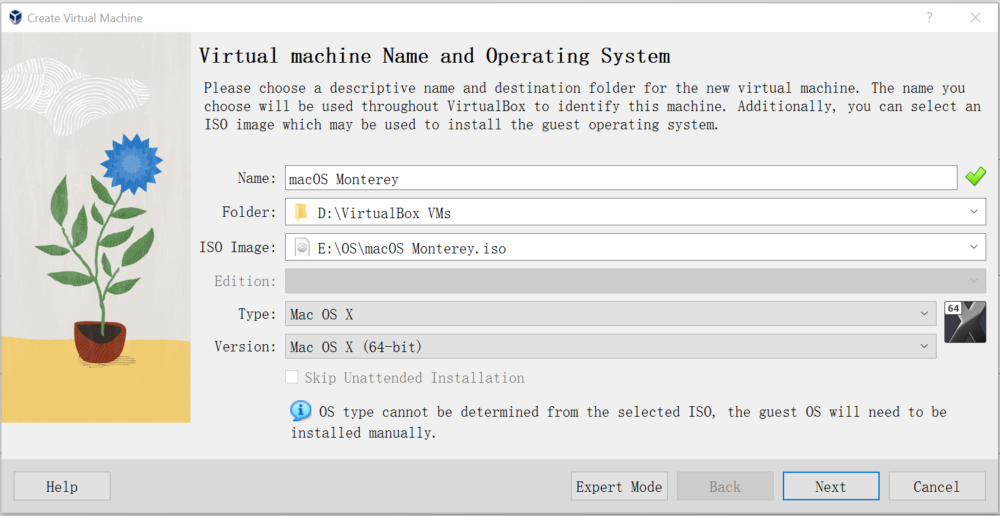

##### 硬件选择

内存建议最小4G, 处理器选择1个（多个处理器有问题，无法成功安装!!!）
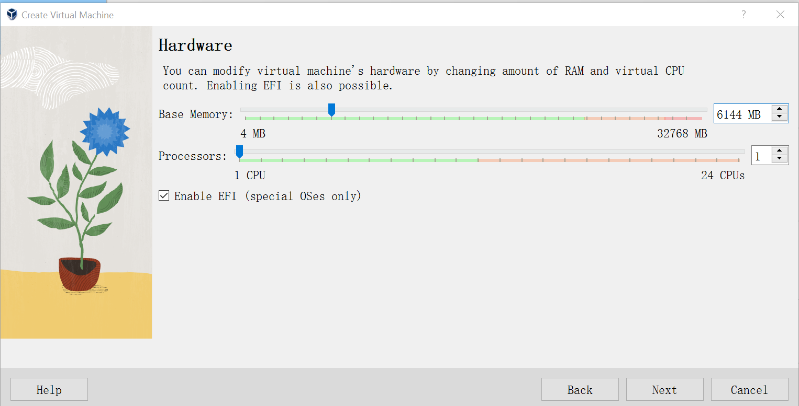

##### 虚拟硬盘

建议最小35G
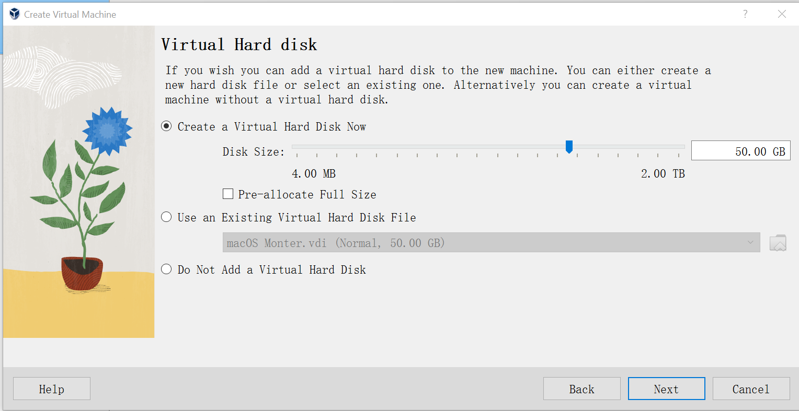
下一步完成创建

##### 虚拟机设置

- 启动顺序如图， Chipset 选则 ICH9
  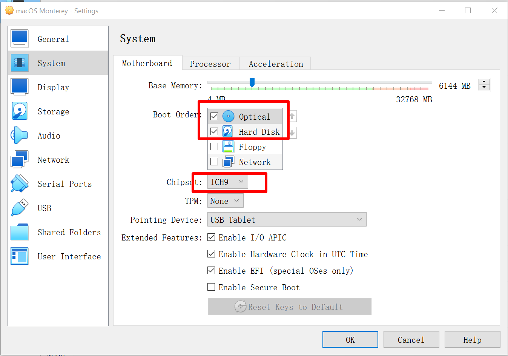
- Video Memory 选择 128M
  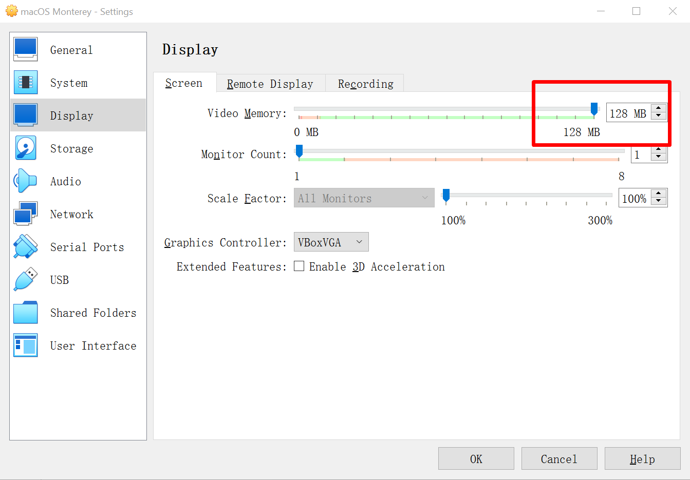
- USB 可以禁用， 或选择 USB 3.0

##### 添加自定义代码

以管理员权限打开 Terminal，进入 VirtualBox 安装目录，执行以下命令

```PowerShell 
.\VBoxManage modifyvm "macOS Monterey" --cpuidset 00000001 000106e5 00100800 0098e3fd bfebfbff
.\VBoxManage setextradata "macOS Monterey" "VBoxInternal/Devices/efi/0/Config/DmiSystemProduct" "iMac19,1"
.\VBoxManage setextradata "macOS Monterey" "VBoxInternal/Devices/efi/0/Config/DmiSystemVersion" "1.0"
.\VBoxManage setextradata "macOS Monterey" "VBoxInternal/Devices/efi/0/Config/DmiBoardProduct" "Mac-AA95B1DDAB278B95"
.\VBoxManage setextradata "macOS Monterey" "VBoxInternal/Devices/smc/0/Config/DeviceKey" "ourhardworkbythesewordsguardedpleasedontsteal(c)AppleComputerInc"
.\VBoxManage setextradata "macOS Monterey" "VBoxInternal/Devices/smc/0/Config/GetKeyFromRealSMC" 0
```

#### 启动虚拟机安装MacOS

启动虚拟机后，开始会展示出大量的文本字符界面，稍后会出现初始界面

##### 选择系统语言

我这里使用的默认选择
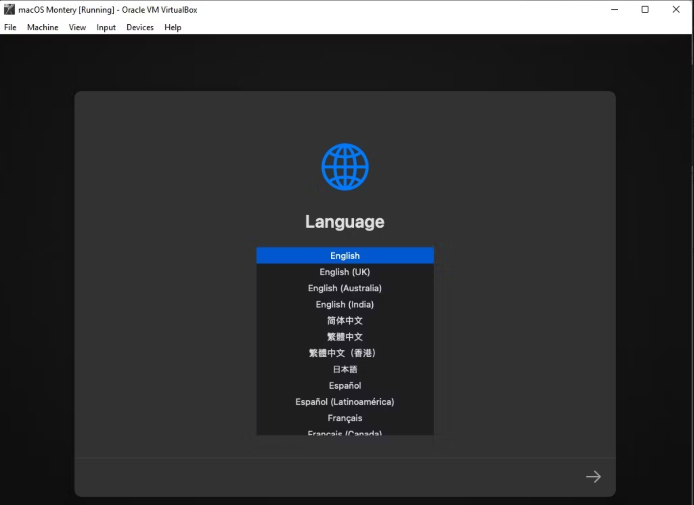

##### 硬盘设置

点击 **Dist Utility**， 进入后选择 **VBOX HARDDISK MEDIA**, 在窗口上方右侧，选择 **Erase**， 会弹出一个小窗口，
填写硬盘驱动名称，选择格式 **Mac OS Extended(Journaled)**, 选择 **GUID Partition Map**, 确定即可。
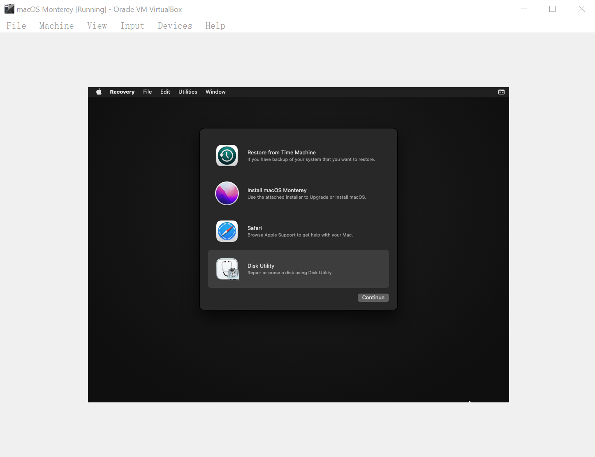
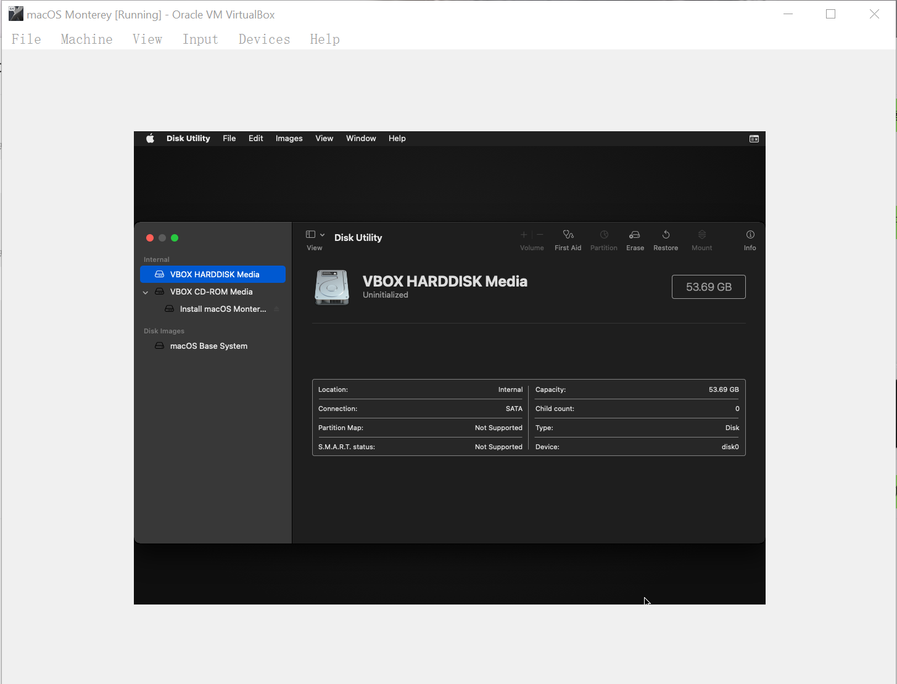
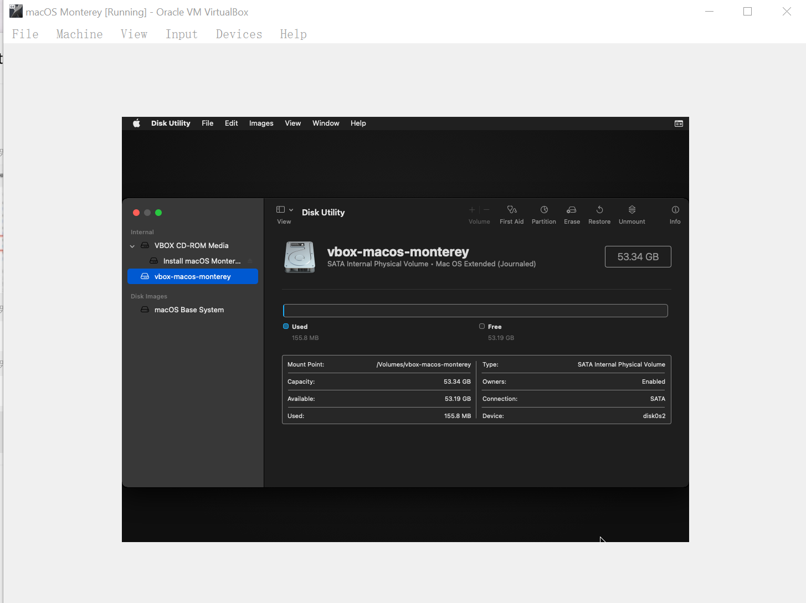

##### 安装

配置好后，即可看到刚命名的硬盘， 左上角关闭窗口。 选择 **Install macOS Monterey**
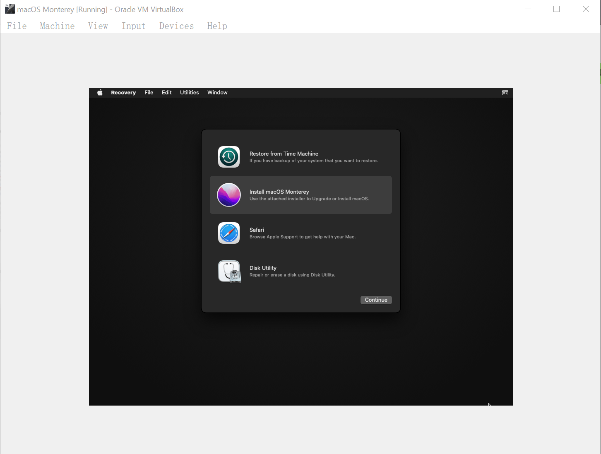
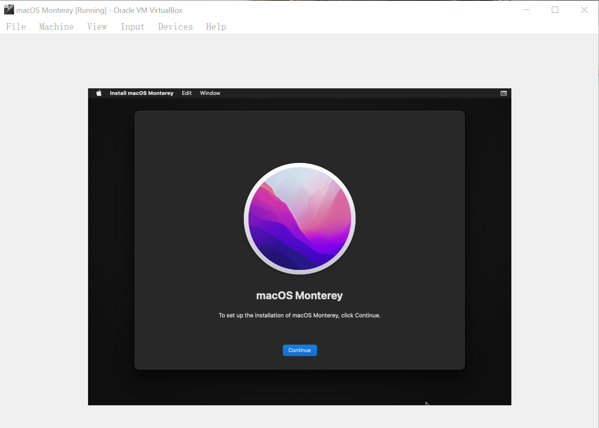
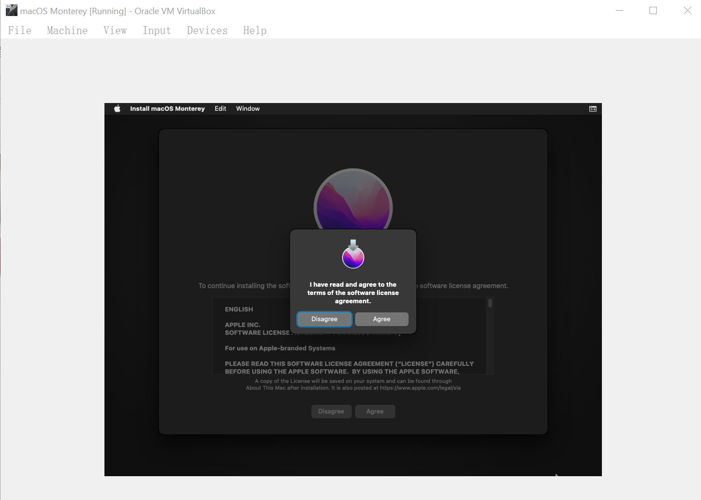

##### 安装位置

选择刚创建的硬盘, 这里比较耗时，可能需要1到2个小时
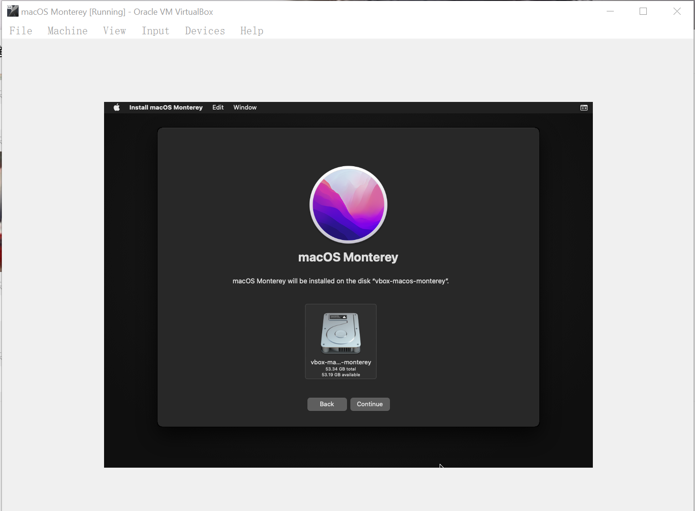
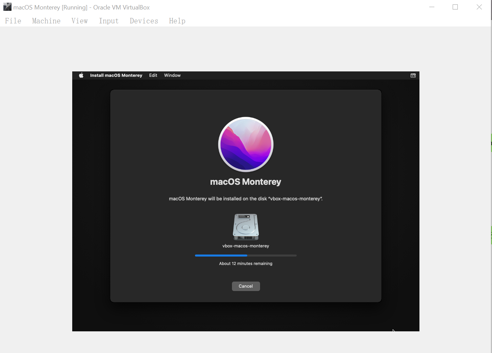

##### 系统配置

安装完成后，需要对系统进行一些偏好设置, 按需即可。
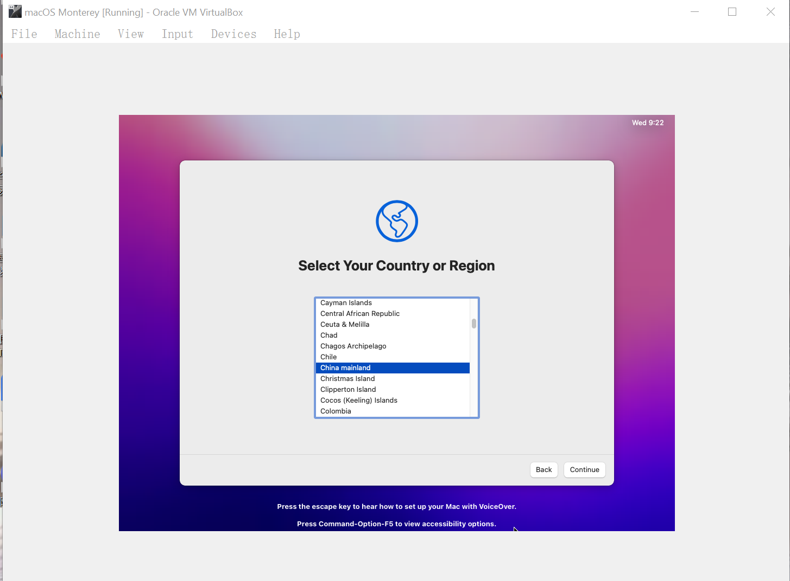

文章参考 [How to Install macOS on Windows 10 in a Virtual Machine](https://www.makeuseof.com/tag/macos-windows-10-virtual-machine/)