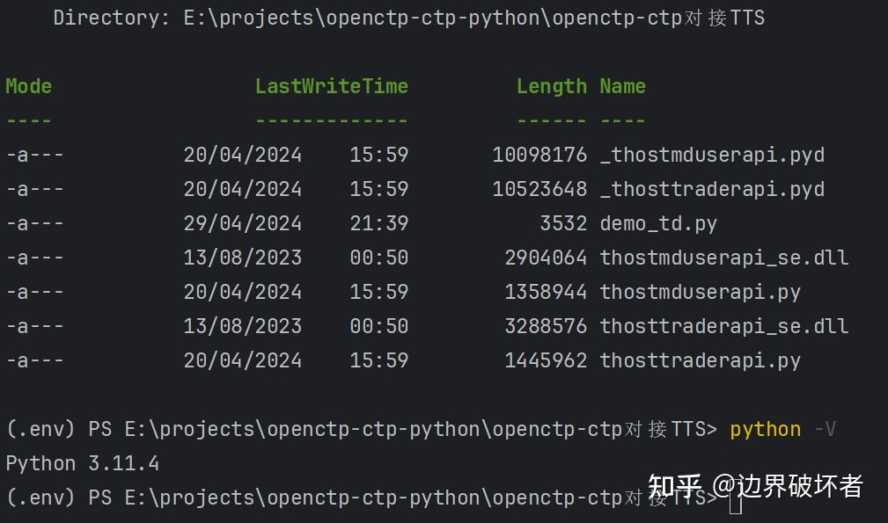
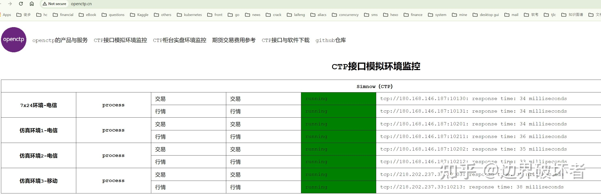
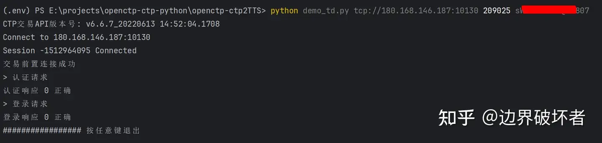
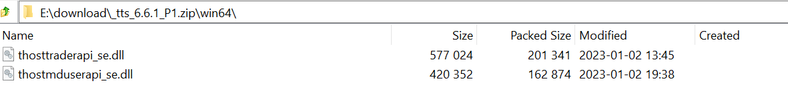
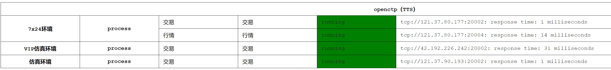
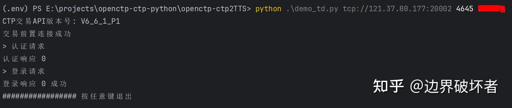
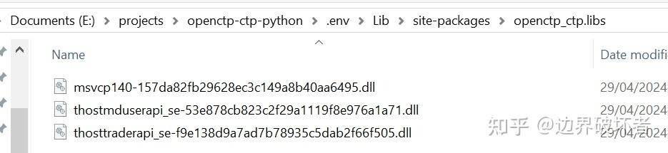
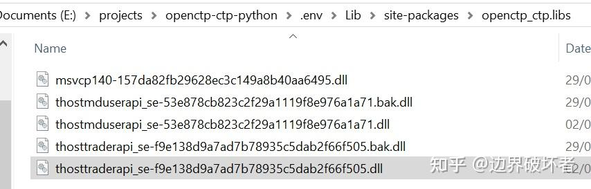

[openctp-ctp](https://github.com/openctp/openctp-ctp-python) 是由 [openctp](https://github.com/openctp) 团队开放的
Python 版 CTPAPI, 可以使用 Python 方便的对接 CTPAPI ，
详情见 https://github.com/openctp/openctp-ctp-python 。

> openctp是一个以CTP生态为基础的技术服务平台，通过将中泰XTP、华鑫奇点等股票柜台的接口封装成CTPAPI，
> 使得CTP程序只需将CTP动态库如"thosttraderapi_se.dll"替换成各柜台的同版本CTPAPI动态库即可接入相应柜台，可以帮助开发者节省大量的接口对接成本。
>
> openctp提供了一套与上期技术SimNow类似的模拟环境，支持CTPAPI接口，不仅提供国内各期货交易所的期货与期权品种模拟交易，还提供了A股的股票、基金、债券以及股票期权模拟交易，也支持港股、美股等市场模拟交易。
>
> TTS全称Tick Trading System，是openctp开发的一款支持多通道多账户多交易员的交易系统，以CTPAPI接口对外通讯，openctp的模拟平台就是采用TTS系统提供模拟交易服务。

openctp-ctp 安装后，默认是只能连接 支持 CTPAPI 官方实现的 柜台，如Simnow。 上面也说了， openctp-ctp 提供了一个兼容各柜台接口的能力,
那么本文就说明一下 openctp-ctp 替换动态库后 对接 TTS的过程。

### 方式一，手动安装 openctp-ctp

#### 手动安装

参考官方说明的 手动下载配置 ， 我这里选择的是 6.6.7_20220613 / win64 / Python 3.11

配置好如下图所示 
执行命令

```bash
  python demo_td.py tcp://180.168.146.187:10130 <user id> <password>
```

> \<user id> 是在 simnow 申请的账号，password 是账号密码
> tcp://180.168.146.187:10130 是 simnow 的 7x24 环境交易前置，simow 提供了3套环境，使用前可以在 openctp官网 检查对应环境是否正常。
>
> demo_td.py 链接是 https://github.com/openctp/openctp-ctp-python/blob/main/demo/demo_td.py


执行结果如下


#### 替换动态库

从 openctp 官网 下载 TTS 6.6.1文件 http://openctp.cn/Download/CTPAPI/TTS/tts_6.6.1_P1.zip 解压后可以得到如图所示的两个文件

没错，就是用这两个文件替换 图1 中的同名文件。

执行命令

```bash
python demo_td.py tcp://121.37.80.177:20002 <user id> <password>
```

> \<user id> 是在 openctp 申请的账号，password 是账号密码  
> tcp://121.37.80.177:20002 是 openctp 的 7x24 环境交易前置，
> openctp也提供了3套环境，使用前可以在 openctp官网 检查对应环境是否正常。这三套环境账号不通用。


执行结果如下，则成功通过替换动态库的形式对接到了 TTS 通道。


### 方式二, 自动安装 openctp-ctp

#### pip安装

我这里选择的是 6.6.1

```bash
pip install openctp-ctp==6.6.1.*
```

仍使用 demo_td.py 测试，需要将 demo_td.py 中的

```python
import thosttraderapi as tdapi
```

替换为

```python
from openctp_ctp import tdapi
```

执行命令

```bash
python demo_td.py tcp://180.168.146.187:10130 <user id><password>
```

结果同 图3 则成功。

#### 替换动态库

通过 “pip -V” 命令找到python库安装路径，然后定位到 openctp_ctp， 我这里的路径是

```powershell
e:\projects\openctp-ctp-python\.env\lib\site-packages\openctp_ctp.libs
```



将 图7 中的 thostmduserapi_se-53e878cb823c2f29a1119f8e976a1a71.dll
thosttraderapi_se-f9e138d9a7ad7b78935c5dab2f66f505.dll 备份， 并使用 图4 中的两个dll文件移动到 openctp_ctp.libs 中并重命名


使用修改后的 demo_td.py 重新执行命令

```bash
python demo_td.py tcp://121.37.80.177:20002 <user id> <password> 
```

得到如 图6 中的结果，则成功通过替换动态库的形式对接到了 TTS 通道。

**以上只是针对交易通道为例进行了说明，行情通道一样的逻辑，请自行验证。**

> 关注微信公众号 **openctp**, 发送 **注册** 即可申请 openctp 环境账号