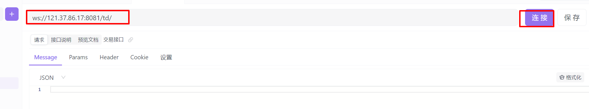
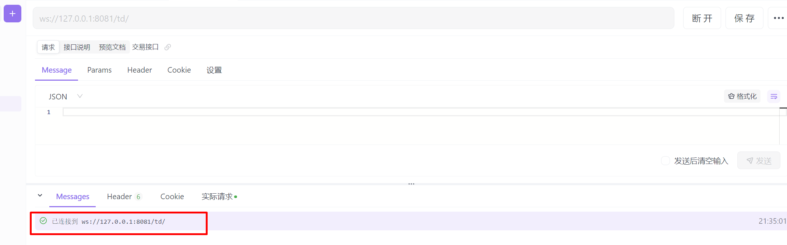
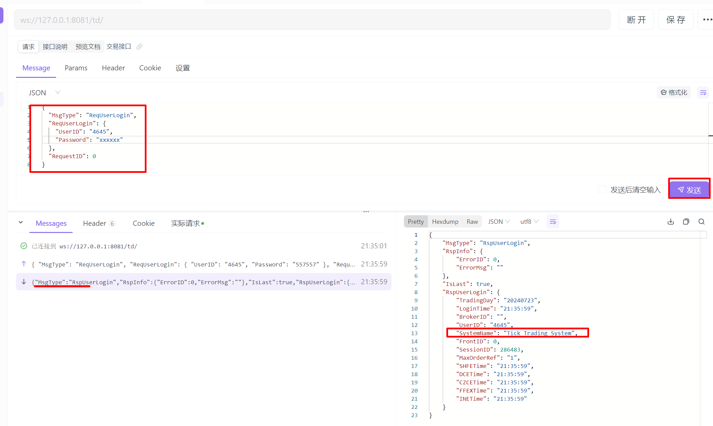

[webctp](https://github.com/openctp/webctp) 是一个基于 [openctp-ctp](https://github.com/openctp/openctp-ctp-python)
开发的提供websocket接口的CTP服务。以websocket+json协议提供CTP交易及行情服务，适合web类产品开发。

而 openctp-ctp 只支持连接 ctpapi 官方实现的柜台, 譬如经常使用的测试平台 SimNow。 
但是由于众所周知的原因, SimNow 柜台服务时不时地哑火， 让无数小伙伴不时咬牙切齿。

**TTS**(全称Tick Trading System)，是openctp开发的一款支持多通道多账户多交易员的交易系统，以CTPAPI接口对外通讯，openctp的模拟平台就是采用TTS系统提供模拟交易服务。
也就是说，可以使用 TTS 替代 SimNow 进行 CTP 的开发测试模拟。那么 webctp 能否连接 TTS 呢？

**openctp-ctp-channels** 正好可以解决这个问题，让 openctp-ctp 拥有连接 TTS 柜台的能力。

1. 安装 openctp-ctp
   ```bash
   pip install openctp-ctp
   ```
2. 安装 openctp-ctp-channels
   ```bash
   pip install openctp-ctp-channels
   ```
3. 切换TTS通道
   ```bash
   openctp-channels switch tts
   ```
4. 配置 webctp 文件 `config_td.yaml`
   ```yaml
   TdFrontAddress: tcp://121.37.80.177:20002 # 交易前置地址  TTS 7x24环境
   MdFrontAddress: tcp://121.37.80.177:20004 # 行情前置地址  TTS 7x24环境
   BrokerID: ""
   AuthCode: ""
   AppID:
   Port: 8081         # the listening port, default 8081
   Host: 0.0.0.0      # the bind ip address, default 0.0.0.0
   LogLevel: DEBUG     # NOTSET, DEBUG, INFO, WARN, ERROR, CRITICAL
   ```
5. 启动 webctp
   ```bash
   $ python main.py --config=config_td.yaml --app_type=td
   2024-07-22 21:25:02,696 - root - INFO - start td app
   INFO:     Started server process [27624]
   INFO:     Waiting for application startup.
   INFO:     Application startup complete.
   INFO:     Uvicorn running on http://0.0.0.0:8081 (Press CTRL+C to quit)
   ```
6. ApiFox 连接
   可以使用 ApiFox 作为客户端连接 webctp 服务进行验证
   - 新建 WebSocket 接口，完整url地址: `ws://127.0.0.1:8081/td/`
      
      点击 `连接` 按钮，如下图
      
      webctp服务端也会打印新建连接
      ```text
      INFO:     ('127.0.0.1', 57841) - "WebSocket /td/" [accepted]
      INFO:     connection open
      ```
   - 填写登录请求
      ```json
      {
        "MsgType": "ReqUserLogin",
        "ReqUserLogin": {
          "UserID": "4645",
          "Password": "xxxxxx"
        },
        "RequestID": 0
      }
      ```
      `4645` 是在 openctp 微信公众号申请的 7x24 环境账号。
      点击消息 `发送`, 结果如下
      
      从应答结果中的 `"SystemName": "Tick Trading System"` 可知，已经连接到了 TTS 柜台 7x24 环境。

**上面只进行了交易前置的连接测试， 同样，行情也是类似的测试方法，参考 webctp 的行情接口指导即可。**

到此，可以利用 webctp 连接 TTS柜台 7x24 小时不停的愉快的进行开发测试了。

> 注意：当使用 openctp-ctp-channels 切换 TTS 通道以后，openctp-ctp 只能连接 TTS 柜台，若再想 连接 SimNow 需要切回 CTP 通道 `openctp-channels switch ctp`